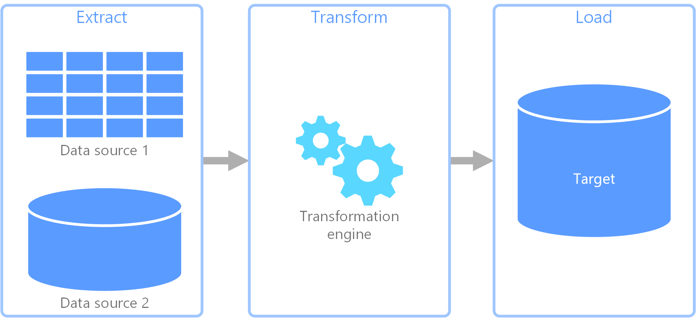

# ETL-pipeline-python

## Background

ETL pipelines are the backbone of any data related task. ETL is an acronym for Extract, Transform, and Load. Real world data is often clumsy and requires certain degree of preprocessing before it can be fed to end applications. ETL pipelines are designed to achieve the goal of data preprocessing. They take in raw data and spit out clean data stored in SQL or NoSQL databases.

## ETL Explanation

Every ETL pipeline has three stages:

1. Data extraction from some source/s (say flat files or some database)

2. Data transformation using some tools

3. Loading of data in SQL or NoSQL databases

The loaded data is then used in end applications. One possible use case is analyzing the cleaned data for business reporting using tools like [Tableau](https://www.tableau.com/) and [MS Power BI](https://powerbi.microsoft.com/).

## Explaining Work in Repo

This repository builds custom ETL pipelines in Python. Two data pipelines have been designed using the files in this repository:

1. In the first ETL pipeline, raw data is extracted from flat files using Pandas. The extracted data is then transformed using Pandas and Numpy. Finally, the transformed data is loaded in a NoSQL database, MongoDB, hosted on [MongoDB Atlas](https://www.mongodb.com/atlas/database). The data loading process is carried out with the help of [PyMongo](https://pymongo.readthedocs.io/en/stable/) — MongoDB's native driver for Python.

2. In the second ETL pipeline, data is extracted from flat files using Pandas. Data is then transformed according to the requirements using Pandas and Numpy. Finally, the data is loaded in a SQL database, SQL Server, hosted locally. MS SQL Server's recommended connector for Python, [pyodbc](https://pypi.org/project/pyodbc/), has been used in data loading step. **Due diligence has been exercised in ensuring compliance with key database engineering concepts such as [database normalization](https://docs.microsoft.com/en-us/office/troubleshoot/access/database-normalization-description).**

## Files in Repo

1. **tk-5-normalization.py**

     This file implements the complete pipeline from extracting the data from flat files to creating three relational tables (two facts and one dim table) in SQL Server. The script also populates over 25k rows of data in 24+ columns in the three tables of the database in a way that the database is in *[2nd Normal form](https://www.geeksforgeeks.org/difference-between-1nf-and-2nf-in-dbms/?ref=lbp).*

2. **tk-5.py**

    This file was created to create a simple database (*First Normal Form*) in SQL Server while populating db table with values by iterating over a pandas dataframe.

3. **sqlserver.py**

    This file was created to test db connection with SQL Server hosted on the local machine. Moreover, a table was created in the db and a few rows were added in it.

4. **mongo.py**

    This file was created to establish a connection with MongoDB database hosted on AWS from MongoDB Atlas. This file uses a module `config` that contains the required credentials (connections string, user, password) to connect to MongoDB. **The config module is not a part of this repo and you can use your own config file to use mongo.py.**

5. **data.py**
    This file uses a custom python class to extract and transform raw data from flat files so that it can be inserted into a db on MongoDB cluster on Atlas. Two different collections are created in the db to store half a dozen documents in each collection.
